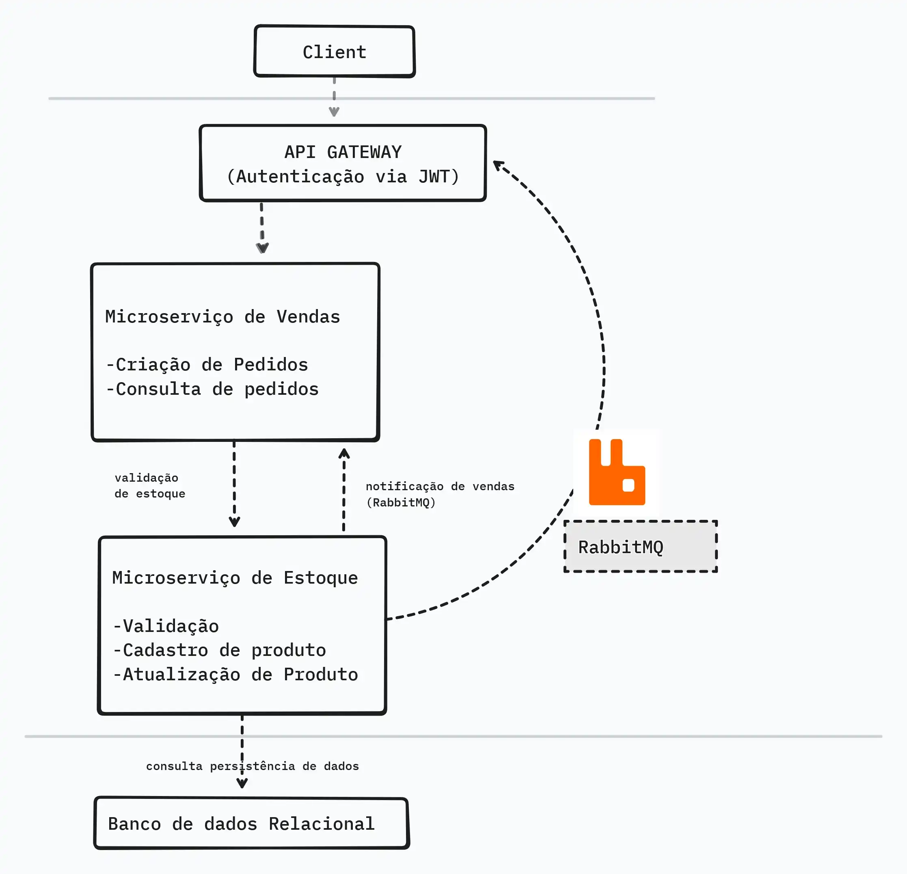

# 🛒 ECommerce Microservices

Este projeto implementa um **sistema de e-commerce** baseado em **arquitetura de microsserviços**.
Foi desenvolvido como parte de um **desafio técnico**, com foco em boas práticas, separação de responsabilidades e integração entre serviços.

---

## 📌 Arquitetura

O sistema foi construído em microsserviços, cada um responsável por um domínio:

- **AuthService** → autenticação e geração de JWT
- **OrdersService** → gerenciamento de pedidos
- **ProductsService** → catálogo de produtos
- **Gateway/API** → entrada única (quando aplicável)
- **Mensageria** → RabbitMQ para comunicação assíncrona
- **Banco de Dados** → SQL Server para persistência

### 🔹 Diagrama de Arquitetura



---

## 🚀 Tecnologias Utilizadas

- **.NET 7 / ASP.NET Core** – APIs REST
- **Entity Framework Core** – ORM
- **SQL Server** – banco relacional
- **RabbitMQ** – mensageria entre serviços
- **JWT Authentication** – segurança
- **Swagger / OpenAPI** – documentação de endpoints
- **Docker + Docker Compose** – orquestração

---

## ⚙️ Como Rodar o Projeto

1. Clone o repositório:

   ```bash
   git clone https://github.com/seu-repo/ecommerce-microservices.git
   cd ecommerce-microservices

2. Suba os containers com Docker Compose:

    ```bash
    docker-compose up --build

3. O sistema irá expor os seguintes serviços:

AuthService → http://localhost:5001

ProductsService → http://localhost:5002

OrdersService → http://localhost:5003

RabbitMQ Management → http://localhost:15672 (login: guest / guest)

SQL Server → localhost,1433

## 🔑 Autenticação

O sistema utiliza JWT.
Existem dois usuários padrão já configurados em memória no AuthController:

* Admin

  Username: admin

  Password: admin123

  Role: Admin

* User

    Username: user

    Password: user123

    Role: User

## 📌 Endpoints
1) Login e geração de token

```
POST http://localhost:5001/auth/login
Content-Type: application/json

{
  "username": "admin",
  "password": "admin123"
}

```
Resposta:
```
{
  "token": "<JWT_TOKEN>"
}
```

2) Criar Pedido (User ou Admin autenticado)
```
POST http://localhost:5003/api/Orders
Authorization: Bearer <JWT_TOKEN>
Content-Type: application/json

{
  "customerId": "user",
  "items": [
    { "productId": 1, "quantity": 2, "unitPrice": 99.90 }
  ]
}
```
3) Listar Pedidos (somente Admin)
```
GET http://localhost:5003/api/Orders
Authorization: Bearer <JWT_TOKEN>
```
4) Listar Produtos
```
GET http://localhost:5002/api/Products
```

## 🧪 Testes com REST Client (VSCode)

Você pode usar o arquivo rest.http para testar rapidamente:
```
### Login
POST http://localhost:5001/auth/login
Content-Type: application/json

{
  "username": "user",
  "password": "user123"
}

### Criar pedido
POST http://localhost:5003/api/Orders
Authorization: Bearer {{token}}
Content-Type: application/json

{
  "customerId": "user",
  "items": [
    { "productId": 1, "quantity": 1, "unitPrice": 5500.00 }
  ]
}

```

## 📝 Sobre o Desafio

O objetivo deste desafio foi:

Projetar uma arquitetura de microsserviços para e-commerce

Implementar autenticação e autorização com JWT

Separar bem os DTOs das entidades de domínio (evitando ciclos de serialização)

Utilizar RabbitMQ para comunicação assíncrona

Orquestrar tudo com Docker Compose

O resultado é um ambiente escalável, desacoplado e pronto para evoluir com novos microsserviços.


Feito por Danubio